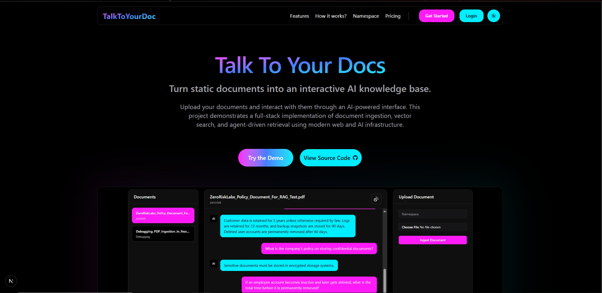
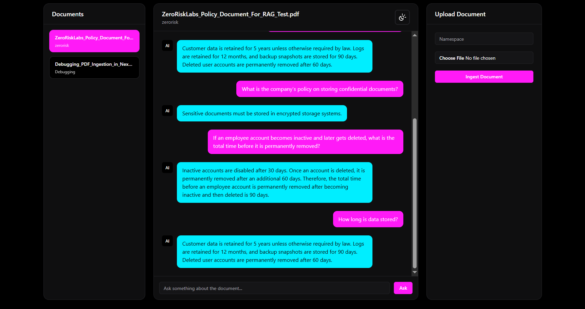

## TalkToYourDoc

An end‑to‑end **agentic Retrieval‑Augmented Generation (RAG)** system built on **Next.js App Router**, **LangGraph**, **Google Gemini (chat + embeddings)**, **MongoDB vector search**, and **Upstash Redis**.



**Turn static documents into an interactive AI knowledge base.**

Users can:

- **Register / sign in** with email + password (NextAuth + custom OTP verification)
- **Upload documents** (PDF, Markdown, TXT) into a **namespaced knowledge base**
- **Ingest & embed** content into a **MongoDB‑backed vector store**
- **Chat with an agentic RAG pipeline** that:
  - Retrieves relevant chunks via vector search
  - Uses a **LangGraph** workflow over Gemini
  - Returns **answers with chunk IDs and document metadata** for traceability
- **View conversation history** per document

---

**Interact with your docs through an AI powered dashboard.**



### Tech Stack

- **Frontend / App**
  - Next.js `app/` router (`next` 16)
  - React 19, Tailwind CSS 4, shadcn‑inspired UI components
  - Zustand store for dashboard state (`src/store`)
  - Themed UI via `next-themes`

- **AI & RAG**
  - LangGraph (`@langchain/langgraph`) for the **agentic graph**
  - LangChain core + text splitters
  - Google Gemini chat (`@langchain/google`) & embeddings (`@langchain/google-genai`)

- **Data & Infra**
  - MongoDB (with `$vectorSearch` aggregation) via Mongoose
  - Upstash Redis for OTP / temp user data
  - NextAuth (credentials provider) for auth
  - Nodemailer for email OTP delivery

---

### High‑Level Architecture

- **Landing experience** (`src/app/page.tsx`)
  - Marketing layout: `Navbar`, `Hero`, `Features`, `Working`, `Namespace`, `Pricing`, `Footer`.

- **Auth flow** (`src/app/(auth)`)
  - `register/page.tsx`: Email + password **registration** form. On success, an OTP is sent via email and a `registration_key` is saved in `sessionStorage`.
  - `verify/page.tsx`: OTP verification with a **countdown timer**; calls `/api/auth/verify`.
  - `signin/page.tsx`: Credentials sign‑in using `next-auth` `CredentialsProvider`.
  - `src/lib/auth.ts`: NextAuth configuration (JWT strategy, user lookup with Mongoose, bcrypt password checks, redirect to `/dashboard`).

- **Dashboard / RAG experience** (`src/app/dashboard`)
  - `page.tsx`: Responsive 3‑pane layout (Docs list, Chat, Upload) on desktop, tab‑based on mobile.
  - `RenderDocs.tsx`: Lists ingested documents for the authenticated user by calling `POST /api/rag/files`, sets **active document**, and triggers message fetch.
  - `AskQuery.tsx`: Chat UI bound to the `activeDoc`; sends queries to `POST /api/rag/query`, then renders agent responses and **ChunkIDs** for transparency.
  - `UploadDoc.tsx`: Namespace + file upload form; calls `POST /api/rag/ingest` and adds the ingested document to the local store.

- **State management** (`src/store/store.ts` + `src/store/storeTypes.ts`)
  - Keeps **documents**, **activeDoc**, **messages**, loading flags.
  - Provides actions to:
    - Fetch documents from `/api/rag/files`
    - Fetch messages for the active document from `/api/rag/message`
    - Add messages (user & agent turns) locally during chat

- **RAG API surface** (`src/app/api/rag`)
  - `ingest/route.ts`: End‑to‑end ingestion pipeline for a single uploaded file.
  - `files/route.ts`: Returns all documents for the current user.
  - `message/route.ts`: Returns the sorted chat history for a document.
  - `query/route.ts`: Main agent endpoint; runs the LangGraph pipeline and stores messages.

---

### Knowledge Base & Vector DB Pipeline

The knowledge base is built in **five steps** (`src/knowledgebase`), orchestrated by `POST /api/rag/ingest`:

1. **File upload & metadata**
   - `UploadFile` (`src/lib/fileupload.ts`):
     - Accepts a `FormData` request (`file` + `namespace`).
     - Persists the raw file under `./public/<filename>`.
     - Returns `{ filePath, fileName, namespace }`.
   - `Documents` model (`src/models/document.model.ts`):
     - One DB row per uploaded file, with `userID`, `source`, and a **namespace** (e.g. `technical`, `legal`, `product_manual`, etc.).

2. **Load file into LangChain `Document[]`** — `01_loader.ts`
   - Supports:
     - `application/pdf` (PDF, via `pdf-parse` v2)
     - `text/markdown`
     - `text/plain`
   - PDFs:
     - Uses `PDFParse` to get text and splits by page (`\f`), creating one `Document` per page with `metadata.source`, `metadata.type = "pdf"`, and `metadata.page`.
   - Text / Markdown:
     - Reads the whole file, storing content in a single `Document`.

3. **Chunking** — `02_splitter.ts`
   - Uses `RecursiveCharacterTextSplitter` with:
     - `chunkSize = 800`
     - `chunkOverlap = 150`
   - Returns new `Document[]` where each chunk:
     - Has trimmed `pageContent`
     - Carries forward metadata, adds `_chunkIndex` and default `source` if missing.

4. **Embedding / Tokenization** — `03_tokenizer.ts`
   - For each chunk:
     - Generates an embedding using `getEmbeddingModel()` (`GoogleGenerativeAIEmbeddings` with `gemini-embedding-001`).
     - Builds a `Token` with:
       - `namespace`, `text`, `embedding`, `source`, `chunkID`.
   - Uses `Promise.allSettled` and returns only fulfilled tokens.

5. **Ingestion into the vector DB** — `04_ingestion.ts`
   - Persists tokens into MongoDB as `Chunk` documents (`src/models/chunks.model.ts`):
     - Fields: `userID`, `docID`, `text`, `embedding`, `namespace`, `source`, `chunkID`.
   - Returns basic ingestion metadata: status, `chunkCount`, `nameSpace`, `source`, `docID`.

6. **Vector retrieval** — `05_retriever.ts`
   - Given `{ query, docID, userID }`:
     - Embeds the **query** with the same Gemini embedding model.
     - Runs a MongoDB `$vectorSearch` aggregation:
       - `index: "vector_index"`
       - `path: "embedding"`
       - `numCandidates: 50`, `limit: 5`
       - Filters by `userID` and `docID`.
     - Returns an array of **context** objects `{ text, namespace, source, chunkID }`.

> **Note:** You must configure a MongoDB Atlas cluster (or compatible MongoDB) with a **search index named `vector_index`** on the `Chunk.embedding` field to enable vector search.

---

### Agentic RAG Graph (LangGraph)

The agent workflow is defined in `src/graph`:

- **State & Annotations** — `graph.ts`, `state.ts`
  - `STATE` includes:
    - `query`, `userID`, `docID`
    - `contexts` (retrieved chunks)
    - `answer`
    - `chunkIDs`
    - `message` (diagnostic info)
  - `Annotation.Root` defines the typed graph state.

- **Graph structure** — `graph.ts`
  - Nodes:
    - `"retrieve"` → `retireverNode`
    - `"queryModel"` → `queryMoeldNode`
    - `"finalize"` → `finalizeNode`
  - Edges:
    - `START -> retrieve -> queryModel -> finalize -> END`
  - `initializeGraph({ query, userID, docID })`:
    - Compiles the graph.
    - Invokes it with `makeInitialState(input)`.
    - Returns the final `STATE`.

- **Nodes**
  - `01_retrieverNode.ts` (`retireverNode`):
    - Calls `retrieve` from `05_retriever.ts` using `state.query`, `state.userID`, `state.docID`.
    - Attaches `contexts` back into state.
  - `02_queryModelNode.ts` (`queryMoeldNode`):
    - Gets the Gemini **chat model** via `getChatModel()`:
      - Uses `env.GOOGLE_MODEL` and `env.GOOGLE_API_KEY`.
    - Fetches last N (default 4) messages for the `(userID, docID)` pair for conversational context.
    - Looks up the document’s namespace for better prompting.
    - Builds a **system prompt** using `dynamicPrompt(namespace)` (see `src/graph/dynamicPrompt.ts`).
    - Sends a `HumanMessage` containing:
      - `query`, serialized `context` chunks, and `pastConversation`.
    - Expects the model to return a JSON‑like string; parses it into:
      - `answer`
      - `chunkIDs`
  - `03_finalizeNode.ts`:
    - Validates the state:
      - If no contexts → sets a fallback answer and diagnostic message.
      - If contexts exist but no answer → sets a technical‑error answer.
    - Returns a complete `STATE` object.

---

### RAG API Endpoints

All RAG endpoints live under `src/app/api/rag` and expect a **logged‑in user**; user identity is propagated from NextAuth into the API layer (e.g. via session / middleware and an `x-user-id` header in this codebase).

- **`POST /api/rag/ingest`** — Ingest a document
  - Headers:
    - `x-user-id` – required.
  - Body:
    - `FormData` with:
      - `file` (PDF / TXT / MD)
      - `namespace` (must be one of `NAMESPACE` in `fileupload.ts`).
  - Flow:
    1. Verifies user.
    2. Uploads file to `./public`.
    3. Creates a `Documents` entry.
    4. Loads → splits → embeds → ingests into `Chunk`.
    5. Deletes the temporary uploaded file.
  - Response:
    ```json
    {
      "success": true,
      "message": "Documnet ingested",
      "data": {
        "chunkCount": 42,
        "namespace": "technical",
        "source": "my_doc.pdf",
        "documentID": "..."
      }
    }
    ```

- **`POST /api/rag/files`** — List documents
  - Headers:
    - `x-user-id` – required.
  - Body: `{}` (empty object).
  - Response:
    ```json
    {
      "success": true,
      "message": "Docs fetched",
      "data": [
        {
          "documentID": "...",
          "source": "my_doc.pdf",
          "namespace": "technical"
        }
      ]
    }
    ```

- **`POST /api/rag/message`** — Get conversation history
  - Headers:
    - `x-user-id` – required.
  - Body:
    ```json
    { "documentID": "..." }
    ```
  - Response:
    ```json
    {
      "success": true,
      "message": "Messages fetched",
      "data": [
        { "role": "user", "content": "..." },
        { "role": "agent", "content": "..." }
      ]
    }
    ```

- **`POST /api/rag/query`** — Ask a question about a document
  - Headers:
    - `x-user-id` – required.
  - Body:
    ```json
    {
      "query": "How does billing work?",
      "documentID": "..."
    }
    ```
  - Flow:
    1. Validates `userID`, `query`, `documentID`.
    2. Ensures the document exists and is owned by the user.
    3. Stores the **user message** in `Message`.
    4. Runs the LangGraph (`initializeGraph`).
    5. Stores the **agent message** and returns the final state.
  - Response:
    ```json
    {
      "success": true,
      "message": "Response generated",
      "data": {
        "query": "...",
        "answer": "...",
        "citation": {
          "chunkIDs": [0, 1, 2],
          "namespace": "technical",
          "source": "my_doc.pdf"
        }
      }
    }
    ```

---

### Authentication & Verification

- **NextAuth credentials provider** (`src/lib/auth.ts`)
  - Email + password signin.
  - `jwt` callback attaches `user.id` to the token.
  - `session` callback exposes `session.user.id` for the client.
  - Redirects authenticated users to `/dashboard`.

- **OTP Registration flow**
  - **Temp user data & OTP**:
    - Upstash Redis client (`src/lib/redis.ts`) is used to store a `TempUser` (email, OTP, name, password).
  - **Email delivery**:
    - `src/lib/mail.ts` + `src/lib/mailTemplate.ts` send OTP emails via Nodemailer using `COMPANY_EMAIL` and `COMAPNY_EMAIL_PASS`.
  - **Controllers / APIs**:
    - `/api/auth/register`:
      - Validates input, stores temp user + OTP in Redis, sends email.
    - `/api/auth/verify`:
      - Validates OTP, creates a persistent `User` in MongoDB, and deletes temp data.
  - **Pages**:
    - `register/page.tsx`, `verify/page.tsx`, `signin/page.tsx` implement the UI and call these APIs.

---

### Environment Variables

All environment variables are validated in `src/shared/env.ts` using `zod`. The app will **exit on startup** if any are missing.

Create a `.env.local` file with at least:

```bash
NODE_ENV=development
NEXT_AUTH_SECRET=your_nextauth_secret

GOOGLE_API_KEY=your_gemini_api_key
GOOGLE_MODEL=gemini-1.5-pro   # or another supported chat model

MONGO_DB=your_mongodb_connection_string

UPSTASH_REDIS_REST_URL=your_upstash_url
UPSTASH_REDIS_REST_TOKEN=your_upstash_token

COMPANY_EMAIL=your_smtp_email
COMAPNY_EMAIL_PASS=your_smtp_password
```

> **Important:** Make sure your MongoDB cluster has the **vector search index** configured, and that your Upstash / SMTP credentials are valid.

---

### Running the Project Locally

1. **Install dependencies**

```bash
npm install
```

2. **Set up environment**

- Create `.env.local` as described above.
- Ensure MongoDB, Upstash Redis, and SMTP credentials are reachable.

3. **Run the dev server**

```bash
npm run dev
```

Open `http://localhost:3000` in your browser.

4. **Walkthrough**

- Visit `/register` to create a new account.
- Verify with the OTP sent to your email.
- Sign in at `/signin` (or be redirected via NextAuth).
- Go to `/dashboard`:
  - Use **Upload** to ingest a PDF/MD/TXT into a chosen namespace.
  - Select the document from **Documents**.
  - Use **Chat** to ask questions; answers will include `ChunkIDs` for debugging / inspection.

---

### Customization & Extension Ideas

- **Prompting / behavior**
  - Tweak `dynamicPrompt.ts` and `systemPrompt.ts` to change how the agent reasons and cites sources.
  - Adjust the number of retrieved chunks in `05_retriever.ts` or the number of past messages in `queryMoeldNode`.

- **Namespaces & routing**
  - Extend `NAMESPACE` in `fileupload.ts` and the enum in the `Documents` / `Chunk` models to support your own domain taxonomies.

- **Vector DB backend**
  - Swap MongoDB `$vectorSearch` with another vector DB by:
    - Replacing `05_retriever.ts` (search).
    - Replacing `04_ingestion.ts` (write).

- **UI**
  - `src/components/sections` and `src/components/ui` provide a good base for further dashboard features, multi‑doc views, or richer citation displays.

---

### Scripts

Defined in `package.json`:

- `npm run dev` – Start the Next.js dev server.
- `npm run build` – Build for production.
- `npm run start` – Run the production build.
- `npm run lint` – Run ESLint.
